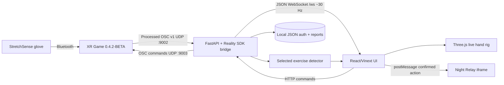

# Technical requirements and design document — Neuro glove rehabilitation

## 1. System context

Neuro is a single-machine Windows application composed of a browser UI, a local Python service, StretchSense XR Game, the vendor OSC SDK, a Three.js hand renderer and an embedded Three.js game.



XR Game is not a visual dependency merely used for a popup: it owns the supported Bluetooth and vendor processing path. Neuro's connection UI and process launcher wrap this dependency, while packet freshness—not process existence—defines whether a glove is connected.

## 2. Technology stack

| Layer | Technology | Purpose |
|---|---|---|
| Main web UI | React 19, TypeScript 5.9, Vinext/Vite, CSS | Doctor/patient workflows and session UI |
| UI utilities | Base UI, shadcn, Lucide, Recharts, date-fns | Accessible controls, icons and report charts |
| 3D hand | Three.js 0.185, FBXLoader | SDK hand model, glove texture, live/guidance/calibration rendering |
| Local service | Python 3.12, FastAPI 0.116, Uvicorn 0.35, Pydantic 2.11 | HTTP, WebSocket, assets, process management and persistence |
| Glove SDK | Vendored StretchSense Reality Python SDK 0.4.1, python-osc 1.9 | OSC v1 decoding and commands |
| Vendor runtime | StretchSense XR Game 0.4.2-BETA (Unity executable) | Bluetooth connection and processed glove stream |
| Exercise engine | Python port/reference-aligned logic from `Gloves.Exercise.cs` | Pronation/supination, circumduction and open-close events |
| Embedded game | Night Relay, TypeScript, Vite 7, Three.js 0.180 | Two-lane movement feedback |
| Persistence | Local JSON plus in-memory sessions | License, doctors, patients, assignments and reports |

## 3. Source ownership map

| Concern | Canonical path |
|---|---|
| Application workflow/state | `glove-dashboard/app/page.tsx` |
| Styling/layout | `glove-dashboard/app/clinical.css`, `globals.css`, `redesign.css` |
| Full-screen session | `glove-dashboard/components/exercise-session.tsx` |
| Game wrapper/bridge | `glove-dashboard/components/exercise-game.tsx`, `exercise-session.tsx` |
| Hand animation/rig | `glove-dashboard/components/live-hand-rig.tsx` |
| Engineering data view | `glove-dashboard/components/handstate-inspector.tsx` |
| Local bridge and API | `glove-dashboard/backend/server.py` |
| Exercise detection | `glove-dashboard/backend/exercise_detector.py` |
| Auth/report persistence | `glove-dashboard/backend/auth_reports.py` |
| Vendored Reality SDK | `glove-dashboard/backend/vendor/reality_sdk` |
| Game source | `night-relay-main/src` |
| Built game used by dashboard | `glove-dashboard/public/night-relay` and compiled desktop bundle |
| Original C# detector reference | `Gloves.Exercise.cs` |
| Hand-rig technical notes | `glove-dashboard/HAND_RIG_REFERENCE.md` |

## 4. Runtime lifecycle

### Startup

1. `Launch-Neuro.cmd` invokes `stop-local.ps1`, then `start-local.ps1`.
2. `start-local.ps1` starts `backend/.venv/Scripts/python.exe -m uvicorn backend.server:app --host 127.0.0.1 --port 3000` in a hidden window.
3. The launcher polls `/api/health`, records the backend PID under `.logs/processes.json`, and opens Chrome at `http://127.0.0.1:3000/`.
4. FastAPI starts the Reality SDK shared state, OSC receiver and sender. Static UI assets come from `glove-dashboard/desktop_bundle/web`.

### Patient connection

1. Patient activation causes the browser to open `/ws`.
2. The UI calls `POST /api/xr-game/launch` when live packets are absent.
3. `XRGameLauncher` resolves `NEURO_XR_GAME_PATH`, then `xr_game.json`, then known relative defaults.
4. The launcher adopts an existing matching process or starts the executable with its own working directory. On Windows it minimizes XR Game without sending UI input.
5. The bridge repeats application-name registration while waiting for data.
6. Hand packet timestamps are recorded for controller, kinematic, orientation and slider packets.

### Shutdown

An explicit disconnect/end-patient action stops the adopted/configured XR Game. When the last WebSocket client closes, the backend schedules a short grace period before stopping its managed XR process. The Python service is stopped by `stop-local.ps1` or closing the packaged runtime.

## 5. Network and protocol design

| Port/path | Direction | Protocol | Meaning |
|---|---|---|---|
| `127.0.0.1:3000` | Browser ↔ Python | HTTP/WebSocket | UI, API, assets, game and telemetry |
| UDP `9002` | XR Game → Python | OSC v1 | Processed HandState, orientation, kinematics, calibration state |
| UDP `9003` | Python → XR Game | OSC v1 | Application registration, BASIC calibration, tare and other commands |
| `/ws` | Python → browser | JSON WebSocket | Approximately 30 full snapshots per second |

The local service binds to loopback. CORS is restricted to documented local origins. Deploying on a LAN or public interface requires a separate threat model, TLS and authentication review.

## 6. API contract summary

| Method and route | Authorization | Function |
|---|---|---|
| `GET /api/health` | None/local | Bridge/stream metadata for launcher and diagnostics |
| `GET /api/state` | None/local | One current glove/exercise snapshot |
| `POST /api/license/validate` | None | Validate local key and dates |
| `GET /api/auth/session` | Cookie when present | Restore doctor, deliberately clear active patient on reload |
| `POST /api/auth/doctor-login` | None | Authenticate doctor and set session cookie |
| `POST /api/auth/patient-login` | Doctor cookie | Select assigned patient by credentials |
| `POST /api/auth/select-patient` | Doctor cookie | Select assigned patient by ID |
| `POST /api/auth/end-patient` | Doctor cookie | Finish active report and clear patient |
| `POST /api/auth/logout` | Doctor cookie | Finish interrupted report, destroy session/cookie |
| `GET /api/patients` | Doctor cookie | List patients assigned to doctor |
| `POST /api/patients` | Doctor cookie | Create patient and assignment |
| `GET /api/reports?patient_id=...` | Doctor cookie | Return authorized reports, optionally filtered |
| `POST /api/reports/session/start` | Doctor cookie + active patient | Start in-memory report capture |
| `POST /api/reports/session/finish` | Doctor cookie | Finalize and save non-empty session |
| `POST /api/xr-game/launch` | Local UI | Start/adopt XR Game and initialize registration |
| `POST /api/xr-game/stop` | Local UI | Stop configured/adopted XR Game |
| `POST /api/exercise` | Local UI | Select hand and exactly one detector, or `none` |
| `POST /api/command` | Local UI | Queue calibration, tare, haptic or application commands |
| `GET /api/models/{side}-hand.fbx` | Local UI | SDK hand model |
| `GET /api/models/{side}-glove.png` | Local UI | SDK glove texture |
| `GET /api/models/{side}-basic-calibration.json` | Local UI | Original XR BASIC animation |
| `WS /ws` | Patient UI by workflow | Stream serialized snapshot around 30 Hz |

Backend authentication currently protects clinical record routes. Glove command routes rely on loopback isolation and workflow gating; before any non-loopback deployment they must also enforce authenticated patient/session authorization server-side.

## 7. Telemetry snapshot

`bridge.snapshot()` serializes current left and right SDK hand structures plus:

- `meta`: SDK version, process/bridge state, packet ages and related health;
- per-hand HandState content such as serial, orientation, joint kinematics, sliders and calibration state when available;
- `exercise`: selected detector, state, latest activity, counters and detector diagnostics.

The frontend determines a hand is live from finite, recent packet age. The current product expectation is a freshness window under two seconds. `xr_game_running` must never be substituted for `left_live` or `right_live`.

## 8. XR Game process and connection design

The configured path is stored at `glove-dashboard/xr_game.json`:

```json
{
  "executable": "../XR Game 0.4.2-BETA/XR Game 0.4.2-BETA/XR Game.exe"
}
```

Resolution order:

1. `NEURO_XR_GAME_PATH` environment variable;
2. `xr_game.json` beside the executable/source/bundle;
3. documented sibling-directory defaults.

The process launcher prevents duplicates, remembers managed PIDs and can adopt a pre-existing XR Game. Starting hidden without ever showing the Unity window is not guaranteed to complete vendor initialization, especially on first use. The implemented compromise starts the real executable normally and minimizes its windows; it does not replace or patch the vendor application.

## 9. Authentication and persistence

### License

`backend/license_keys.json` is a list of records containing key, label, enabled flag, validity start and expiry. The browser may remember the entered key in local storage, but the server performs the date validation. Local files are editable by a machine administrator; this is an offline prototype gate, not tamper-resistant licensing.

### Doctor and patient credentials

`LocalClinicalStore` stores a unique salt and PBKDF2-HMAC-SHA256 hash with 200,000 iterations. Doctor sessions are random URL-safe tokens held in backend memory and sent only through an HTTP-only, SameSite Strict cookie. Process restart invalidates them.

### Data files

```text
backend/data/
  doctors.json
  patients.json
  doctor_patients.json
  reports/
    YYYY-MM-DD/
      PAT-0001/
        <session-id>.json
```

Writes use a temporary file followed by replace for the account lists. The store is protected by an in-process re-entrant lock, but it is not designed for multiple service processes or network-shared concurrent writes.

## 10. Hand rig and animation design

### Asset loading

The backend serves the StretchSense `LeftHandAnims.FBX`/`RightHandAnims.FBX` and `RealityL.png`/`RealityR.png` assets from the UPM SDK, with bundled fallbacks when present. The browser uses Three.js `FBXLoader` and resolves 26 bones named `wavebone_0` through `wavebone_25`.

### Live mode

For each bone, the renderer applies the streamed absolute local transform:

```text
bone.position = SDK local position × 100
bone.quaternion = SDK local quaternion
```

The scale converts SDK metres to the FBX centimetre convention. The live quaternion is not multiplied by the FBX rest quaternion. Doing so caused distorted finger placement and gaps in earlier iterations. Hemisphere alignment or smoothing may only be added after replay validation; it must not alter the coordinate convention.

The scene uses a palm-facing, wrist-down/fingers-up presentation. Camera, light, matte skin and dark glove materials are visual concerns; sensor transforms remain authoritative.

### Guidance mode

Guidance is a separate authored animation path using the same recognizable hand asset:

- pronation/supination: cosine ping-pong through 180 degrees around the forearm axis, approximately 5.2 seconds;
- circumduction: closed fingers plus an x/y wrist orbit, clockwise then anticlockwise, approximately 5.2 seconds;
- open-close: coordinated curl/release of the four fingers while maintaining a stable thumb, approximately 4.2 seconds.

### Calibration mode

The renderer fetches the selected side's original file from `XR Game_Data/StreamingAssets/AnimationData/PROD/{SIDE}/Basic.json`. It interpolates the approximately 300-frame bone transforms and uses quaternion slerp between frames over an approximately 5.8-second loop.

There are deliberately two independent clocks:

- **visual clock:** loops the guide so the patient knows what to do;
- **device state:** OSC articulation status/progress from XR Game.

The modal closes only on device completion, not when the guide reaches its last frame.

## 11. Calibration and tare command sequences

### BASIC articulation calibration

```mermaid
sequenceDiagram
    participant U as User
    participant UI as Neuro UI
    participant API as FastAPI bridge
    participant XR as XR Game
    U->>UI: Click Calibrate
    UI->>API: POST /api/command articulation_basic_calibrate
    API->>XR: OSC articulation delete BASIC
    API->>XR: OSC articulation add BASIC
    XR-->>API: articulation state/progress
    API-->>UI: /ws snapshot
    UI-->>U: Update progress; unlock at state 4
```

### IMU tare

The user holds the chosen wrist at neutral and clicks Tare. The UI sends `action: imu_tare` and the selected side. The bridge invokes `send_calib_imu_tare(handedness)` on port `9003`. It is never automatic because an incorrect pose would redefine the reference orientation.

## 12. Exercise engine

Only one selected detector receives samples for one selected hand. This selection boundary is the first line of protection against double counting and cross-hand input.

### Pronation/supination

Uses relative quaternion change projected onto the forearm axis, angular velocity smoothing with an exponential moving average, a time window, accumulated rotation and consistency/refractory checks. Palm-normal change assists final pronation/supination classification. It detects a completed directional transition rather than a single hardcoded absolute angle.

### Circumduction

Uses smoothed orientation deltas across a rolling window and a probabilistic/score EMA with hysteresis. Projected path area and direction determine clockwise or anticlockwise completion. The detector is intended to recognize a continuous circular path, not independent flexion and deviation threshold crossings.

### Open-close

Uses BEND1/BEND2 channels for the four fingers; it does not depend on a nonexistent tip sensor. Robust aggregation of the middle finger values, adaptive open/closed anchors, EMA, hysteresis and dwell reduce sensitivity to one noisy channel and avoid rigid universal thresholds.

The source reference is `Gloves.Exercise.cs`; the executable implementation is `backend/exercise_detector.py`. Any logic change should be validated using recorded traces and the detector tests, not inferred from the rig appearance.

## 13. Game integration

Night Relay is built separately and served inside a same-origin iframe at `/night-relay/index.html`. When it loads, it posts:

```ts
{ type: 'night-relay-ready' }
```

The parent sends only confirmed exercise actions:

```ts
{ type: 'neuro-game-action', action: 'move_left' | 'move_right' }
```

Current mapping for pronation/supination is pronation → left and supination → right. The game is two-lane and does not expose jump obstacles because no jump exercise exists. Left-glove handedness reversal is a documented deferred bug.

The iframe validates same-origin messages. Game points, collision state and visual effects are not clinical measurements. If the iframe fails, detector events and reports must continue.

## 14. Reporting design

A report begins only after an authenticated doctor has an active patient and the exercise session starts. The initial bridge snapshot establishes calibration/hand/exercise context. Finish merges final counters and metrics, computes duration and writes only when confirmed repetitions are greater than zero.

The UI aggregates records by date, with patient summary, total sessions, total repetitions and duration, then session-level exercise/hand/directional values. Scores without a defined clinical formula are intentionally excluded.

## 15. Build and distribution

### Main UI

```powershell
cd glove-dashboard
npm ci
npm run build
```

The desktop/static artifact must be copied/prepared under `desktop_bundle/web` using the project's existing preparation workflow before source runtime launch.

### Night Relay

```powershell
cd night-relay-main
npm ci
npm run build
```

Copy the resulting static output into `glove-dashboard/public/night-relay`, then rebuild the main UI.

### Python runtime

```powershell
py -3.12 -m venv glove-dashboard/backend/.venv
glove-dashboard/backend/.venv/Scripts/python.exe -m pip install -r glove-dashboard/backend/requirements.txt
```

The shared handoff includes setup and launch scripts. A final zero-install `.exe` is not claimed: the current `DATA_ROOT` is source-relative and needs a freeze-safe writable location before a PyInstaller release can safely persist accounts and reports.

## 16. Failure modes and expected handling

| Failure | Detection | Required behavior |
|---|---|---|
| Port 3000 unavailable | Uvicorn exits/readiness fails | Show launcher error and log path |
| XR executable missing | Launch endpoint cannot resolve path | Show exact configuration guidance |
| XR running, no glove packets | Packet ages null/stale | Keep disconnected dialog; never show live |
| First-run XR permission pending | No packets, visible vendor modal | Tell user to accept in real XR window |
| OSC sender/receiver blocked | No packets/command state change | Check ports/firewall; provide retry |
| WebSocket closes | Browser event/packet timeout | Mark data stale, reconnect with bounded backoff |
| Calibration does not complete | State never reaches 4 | Keep modal open, allow explicit retry |
| Camera denied | `getUserMedia` error | Show camera message; continue exercise |
| Game fails to load | No ready message/iframe error | Continue tracking and reporting |
| Local JSON malformed | Store read/validation error | Fail safely, preserve file for recovery, log details |

## 17. Security and privacy requirements

- Keep the service loopback-only unless a network security redesign is completed.
- Do not include real `backend/data`, logs, local storage, cookies or captured camera media in handoff archives.
- Do not log plaintext passwords, license keys or raw clinical notes.
- Authorize every patient/report request against the authenticated doctor's assignment.
- Add authorization to command and telemetry endpoints before exposing the service beyond the local browser.
- Review third-party XR Game, StretchSense SDK and Night Relay licenses before redistributing outside the authorized team.

## 18. Verification strategy

1. Run Python detector and smoke tests.
2. Build the React UI and Night Relay with type checking.
3. Start port 3000 and verify `/api/health`, `/`, `/ws`, both FBX/texture routes, calibration JSON and game URL.
4. Test license and doctor/patient gates independently.
5. Test XR absent, XR first-run consent, glove live, glove disconnect and reconnect.
6. Compare live hand replay against vendor/Unity output for both hands.
7. Validate each exercise with slow, fast, incomplete and noisy movements.
8. Confirm game messages occur only after detector confirmation.
9. Confirm reports are scoped, date-grouped and omit zero-repetition sessions.
10. Run package manifest/hash verification on a clean Windows test account.

## 19. Known limitations

- Prototype local JSON and in-memory sessions are not suitable for concurrent or regulated production deployment.
- Glove accuracy remains dependent on vendor XR Game processing and valid calibration.
- Direct glove connection without XR Game is not implemented.
- Left-glove game direction mapping needs correction and regression tests.
- Exercise logic is not documented as clinically validated.
- The package requires Python setup; a final self-contained signed executable remains future work.
