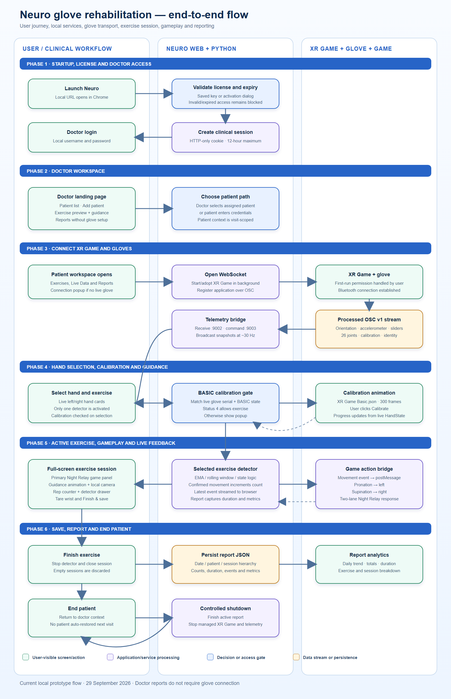

# UI flow and component guide

## End-to-end flowchart



The editable Mermaid source is [`../assets/neuro-end-to-end-flow.mmd`](../assets/neuro-end-to-end-flow.mmd). The diagram is the canonical high-level journey: license, doctor, patient, glove connection, calibration, exercise, gameplay and reports.

## User flow story

### Phase 1 — Local application launch

1. The user starts the local launcher.
2. The Python service binds to `127.0.0.1:3000`, starts the OSC receiver on port `9002`, and opens Chrome to the local application.
3. The browser checks the saved local license key against `backend/license_keys.json`.
4. A missing, disabled, not-yet-valid or expired key blocks the product and shows the license/renewal prompt. A valid key advances to doctor authentication.

This is a local entitlement gate, not a remote licensing service. It should not be represented as online subscription validation until a server-backed implementation exists.

### Phase 2 — Doctor authentication

1. The doctor enters username and password.
2. The backend validates the PBKDF2 password hash and issues an HTTP-only, SameSite Strict session cookie.
3. The doctor lands in the doctor workspace. The doctor session may survive a browser reopen for up to twelve hours; patient context intentionally does not.
4. The initial doctor view immediately loads the doctor's patient directory and allows a new patient to be added.

No glove process is required for doctor login, patient administration, exercise education or historical report review.

### Phase 3 — Doctor workspace

The doctor can:

- browse assigned patients and create a patient;
- select a patient to begin a supervised session;
- preview exercises and their guidance animation without connecting gloves;
- open Reports, select any assigned patient and inspect date-level sessions and trends;
- log out.

Opening a patient from Reports is read-only and must not enter the patient exercise workspace or start XR Game.

### Phase 4 — Patient selection or patient login

There are two supported paths:

- **Doctor-supervised:** the doctor selects a patient card in the directory.
- **Patient credential:** a patient signs in under the authenticated doctor.

After either path, the UI switches to the patient workspace. The active patient name and ID appear in the header. This transition enables glove connection, live data, exercise execution and patient-specific reports.

### Phase 5 — Automatic glove connection

1. The patient workspace opens a WebSocket to `/ws`.
2. If no fresh glove packets exist, the connection dialog explains that the gloves must be powered and available.
3. The backend starts or adopts the configured StretchSense XR Game executable as a Windows process. It minimizes the Unity window and does not intentionally steal focus.
4. XR Game owns Bluetooth pairing and StretchSense processing. It publishes processed OSC v1 packets to `127.0.0.1:9002`.
5. The backend repeatedly sends the SDK application-registration command until packets arrive.
6. A hand becomes **Live** only while packets for it are fresh. The UI must return to disconnected if packet age exceeds the freshness threshold; process-running alone is not a connected signal.

On first use or after XR Game resets its consent state, XR Game may require a real user click on its Early Access/permission screen. The web application cannot safely accept that permission on the user's behalf.

### Phase 6 — Hand selection and exercise selection

If both gloves stream, the user chooses left or right. The chosen hand controls calibration, tare, the live rig and detector input. The user then selects one exercise. Only that detector is active; switching exercises resets transient detector state.

Current exercise choices are:

- wrist pronation/supination;
- wrist circumduction;
- hand/wrist open-close.

### Phase 7 — Calibration gate

Calibration is checked only when an exercise is selected, not at doctor login or while browsing.

1. The application compares the selected glove's serial and BASIC articulation status with the current stream.
2. If BASIC calibration is not complete, a modal blocks exercise start.
3. The modal displays the original XR Game BASIC calibration motion for the selected side.
4. The user clicks **Calibrate**. No command is sent merely by opening the modal.
5. The backend sends BASIC articulation delete followed by BASIC articulation add through OSC port `9003`.
6. Live calibration state and progress update the status UI. The motion guide continues looping independently so the user can copy the expected pose sequence.
7. The exercise may start when the articulation state reports complete (`4`).

### Phase 8 — Active exercise session

The exercise opens as a full-screen clinical session so the patient does not need to scroll. The primary area is the game. A compact side column contains the movement guide and the live local camera feed. Session controls and repetition status remain visible.

The data path is:

```text
selected glove sample -> selected detector -> confirmed movement event
                     -> repetition count and report metrics
                     -> game action through window.postMessage
```

The wrist tare button is deliberately available during the session. It sends an IMU tare command for the selected hand only when clicked. Tare should be performed while the wrist is held in the intended neutral pose.

The camera uses browser permission and remains a local preview. It is not recorded or included in reports.

### Phase 9 — Finish and report creation

When the user finishes:

1. the detector is stopped;
2. elapsed duration, directional counts, total repetitions and available movement metrics are finalized;
3. sessions with zero confirmed repetitions are discarded;
4. valid sessions are written beneath the patient and date in local JSON;
5. the UI returns to the patient workspace, where the patient report tab can display the new result.

### Phase 10 — End patient and logout

**End patient** stops the managed XR Game process, disconnects the active patient context, closes patient-only live features and returns to the authenticated doctor workspace. **Logout** additionally invalidates the doctor session. On browser restart or refresh, the system restores a valid doctor session but never silently restores the previous patient.

## Page and panel responsibilities

| Page or panel | Audience | Responsibility | Important states/actions |
|---|---|---|---|
| License gate | All | Validate local API key and expiry before any clinical data is shown | Missing, invalid, expired, valid; renewal message |
| Doctor login modal | Doctor | Authenticate local doctor account | Loading, invalid credentials, authenticated |
| Application header | Doctor/patient | Brand, primary tabs, glove status and session actions | Exercises, Live Data, Reports, patient identity, End patient, Logout |
| Doctor landing page | Doctor | Patient directory, add-patient entry point and educational exercise preview | Loading directory, empty directory, add patient, select patient |
| Add patient dialog | Doctor | Create a local patient account and doctor assignment | Field validation, duplicate username, success/error |
| Patient login/selection | Doctor/patient | Establish explicit active patient context | Credential login or doctor card selection |
| Connection dialog | Patient | Explain/trigger XR Game connection and show actual stream state | Starting process, waiting for glove, live, retry, actionable failure |
| Patient landing page | Patient | Current exercise workspace before a session begins | Dual live rigs, hand selector, exercise cards, calibration/tare actions |
| Left/right live rig cards | Patient | Visualize the 26-joint HandState and show per-hand connection state | Live/disconnected, selected hand, calibration, tare |
| Exercise selector | Patient | Select exactly one detector and display instructions | Pronation/supination, circumduction, open-close |
| Calibration dialog | Patient | Gate exercise start and coach BASIC articulation calibration | Original XR animation, explicit Calibrate, progress, completion/error |
| Full-screen session shell | Patient | Fit gameplay, guidance, camera and metrics without page scrolling | Start/running/finish, detector drawer, tare |
| Game panel | Patient | Primary engaging feedback surface; consume confirmed movements as controls | Ready, active, collision/game over, play again |
| Guidance panel | Patient | Loop a top/palm-facing reference movement for the chosen exercise | Exercise-specific cycle and labels |
| Camera panel | Patient | Show the patient's physical movement beside the guide | Permission pending/denied, live, unavailable |
| Session metrics | Patient/doctor | Show live repetitions, direction/state and duration | Tracking active, latest event, counts |
| Live Data tab | Patient | Engineering/clinical visualization of current selected-hand data | Available only with active patient and fresh stream |
| Doctor Reports tab | Doctor | List patients and read their date-level history without activating gloves | No reports, patient selection, trends, session drill-down |
| Patient Reports tab | Patient | Show only the active patient's historical and current sessions | Date grouping, totals, duration, directional counts, charts |

## Animation references

### Live hand rig

The live rig is sensor-driven, not a decorative loop. It loads the SDK FBX hand model and glove texture, resolves bones `wavebone_0` through `wavebone_25`, and applies each incoming joint's absolute local position and quaternion. Positions are converted from SDK metres to FBX centimetres. The live path must not be multiplied by an invented bind-pose transform.

The presentation is vertical, wrist down, fingers up and palm facing the user. Camera framing, skin material and glove material may be styled, but bone topology and sensor mapping must remain unchanged unless revalidated against the Unity SDK.

### Calibration animation

The calibration modal uses the original asset from:

```text
XR Game 0.4.2-BETA/XR Game 0.4.2-BETA/
  XR Game_Data/StreamingAssets/AnimationData/PROD/{LEFT|RIGHT}/Basic.json
```

The backend exposes the file as `/api/models/{side}-basic-calibration.json`. The renderer interpolates the recorded bone transforms, using quaternion slerp for rotations, across the approximately 300-frame sequence. This visual timeline is guidance only; the completion indicator comes from the streamed calibration state.

### Exercise guidance loops

- **Pronation/supination:** overhead/palm-facing hand rotates around the forearm axis through the full alternating motion and returns.
- **Circumduction:** fingers remain in a closed-fist pose while the wrist traces a clockwise and then anticlockwise orbit.
- **Open-close:** four fingers curl toward the palm and reopen. The thumb stays anatomically stable rather than bending backward.

Guidance runs from authored animation state. It must never write into the live rig or be interpreted as glove input.

## Visibility and permission rules

| Capability | License only | Doctor authenticated | Patient active | Fresh glove |
|---|---:|---:|---:|---:|
| Doctor login | Yes | — | — | — |
| Patient directory/add patient | No | Yes | Yes | No |
| Exercise education preview | No | Yes | Yes | No |
| Doctor report review | No | Yes | Yes | No |
| Start/adopt XR Game | No | No | Yes | No |
| Live rigs and Live Data | No | No | Yes | Yes |
| Calibration and tare | No | No | Yes | Yes |
| Active exercise/game | No | No | Yes | Yes, calibrated |
| Save patient report | No | No | Yes | Exercise session |

## UX failure behavior

- Never claim a glove is connected solely because XR Game is running.
- If stream packets stop, change the visible status to disconnected and offer retry guidance.
- If camera permission is denied, keep gameplay and glove tracking available and show a compact camera error.
- If calibration stalls, keep the modal open, preserve the coaching animation and provide retry; do not fabricate completion.
- If an API call fails, preserve the current doctor/patient context where safe and show an actionable message.
- If the game iframe fails, exercise counting and reporting must continue; the game is feedback, not the clinical source of truth.
- Reports with no confirmed repetitions must not create misleading zero-result records.
