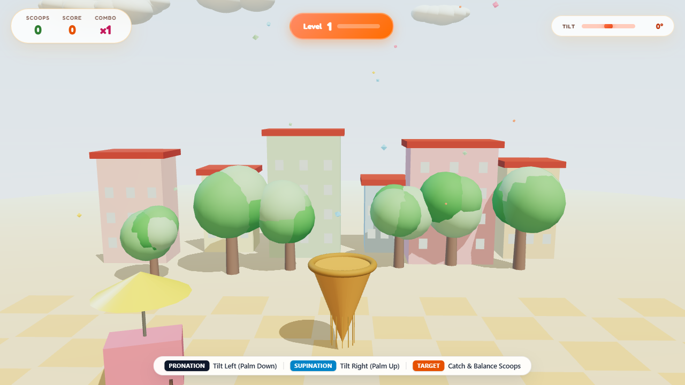
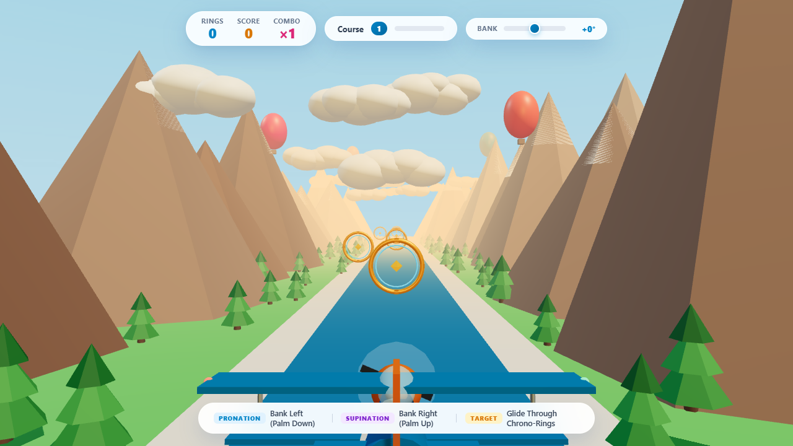
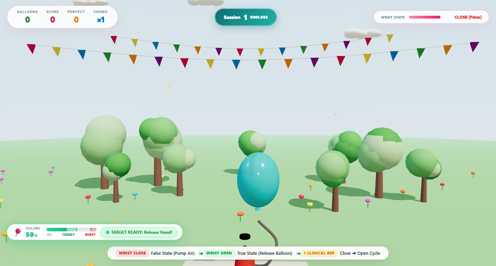
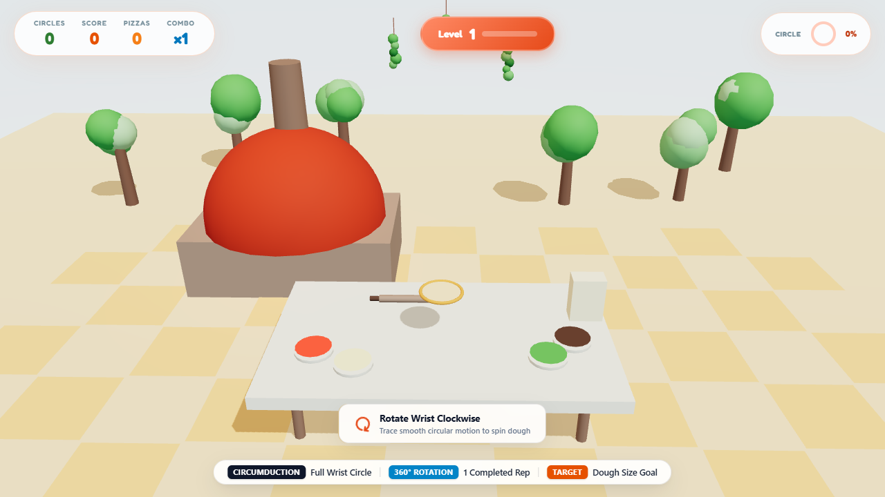
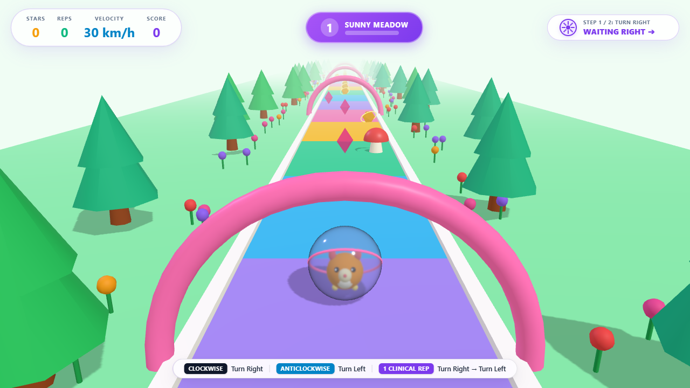

# Neuro-Glove Rehabilitation Suite: Clinical Games and Exercise Protocol Guide

## 1. Clinical Overview and Exercise Mapping Matrix

The Neuro-Glove Rehabilitation Suite translates therapeutic upper-extremity motor exercises into engaging, sensor-driven 3D interactive rehabilitation environments. Designed for post-stroke hemiparesis, traumatic brain injury (TBI), carpal tunnel recovery, cerebral palsy, and neuromuscular re-education, each game is strictly mapped to an isolated single-exercise biomechanical protocol or an advanced compound agility protocol.

All patient interactions are executed strictly through natural hand, finger, and wrist movements captured in real-time by the StretchSense sensor-instrumented rehabilitation gloves. Keyboard and mouse controls are strictly omitted from patient workflows.

### Clinical Exercise Protocol Summary (9-Game Suite)

| Game Title | Target Rehabilitation Exercise | Primary Biomechanical Motions | Target Pathologies | Sensor Telemetry |
| :--- | :--- | :--- | :--- | :--- |
| **Gelato Tower** | Forearm Pronation / Supination | Internal/external forearm rotation around the longitudinal axis | Post-stroke spasticity, distal radius fracture stiffness, pronator synergy | Roll angle IMU (-45° to +45°) |
| **Sky Glider** | Forearm Pronation / Supination | Forearm roll angle controlling glider wings (aileron banking) | Radial head trauma, restricted rotational active ROM, stroke hemiparesis | Roll angle IMU (-45° to +45°) |
| **Highway Racer** | Forearm Pronation / Supination | Forearm rotation acting as steering column (lane shifts) | Rotational contracture, stroke synergy suppression, forearm stiffness | Discrete roll zones: Left (<-15°), Center, Right (>+15°) |
| **Balloon Blitz** | Hand Open / Close | Metacarpophalangeal (MCP) & interphalangeal (IP) grasp & release | Radial nerve palsy, extensor weakness, grasp-release deficit | 5-channel stretch bend sensors (0% to 100%) |
| **Claw Crane** | Hand Open / Close | Graded fist squeeze clamping 4 prongs; full extension opening prongs | Flexor spasticity, weak active digit extension, grasp timing deficit | Flexion threshold (>55% clamp, <25% open) |
| **Hill Climb 4x4** | Hand Open / Close | Power fist squeeze for engine throttle; open hand for active braking | Sustained isometric grip, graded release pacing, extensor recruitment | Continuous flexion throttle (0% to 100%) |
| **Pizza Spin** | Wrist Circumduction | Multi-planar 360° circular carpal motion (flexion, deviation, extension) | Carpal tunnel post-op, radiocarpal contracture, limited functional arc | Integrated carpal vector angle (0° to 360°) |
| **Captain's Wheel** | Wrist Circumduction | Continuous 360° wrist circular revolution turning ship's helm | Chronic wrist stiffness, limited multi-axial articular excursion | Circular angular accumulator (0° to 360°) |
| **Rolling Wonder** | Dynamic Compound Coordination | Wrist tilt steering, rapid finger extension leaping, 360° circumduction turbo | Complex motor coordination, cognitive-motor dual tasking, dynamic stability | Multi-sensor integration (IMU + flex sensors) |

---

## 2. Protocol Category 1: Forearm Pronation & Supination

---

### Game 1: Gelato Tower

#### Clinical Rationale & Target Pathology
Forearm rotation (pronation and supination) is vital for independent daily living activities such as turning door handles, using keys, handling spoons, and holding a drinking cup. Neurological injury often locks the forearm in abnormal flexor synergies (fixed pronation). Gelato Tower trains active rotational range of motion (ROM) through fine motor balancing.

#### Targeted Muscle Groups
- **Forearm Pronation**: Pronator teres, pronator quadratus, flexor carpi radialis assist.
- **Forearm Supination**: Supinator, biceps brachii, brachioradialis (neutral recovery).

#### How to Play Using Rehabilitation Gloves
1. **Patient Posture**: Seated upright with the upper arm stabilized against the torso, elbow flexed to 90 degrees supported on a therapy table. Neutral baseline (0° tilt) is established with the thumb pointing vertically toward the ceiling.
2. **Pronation (Tilt Left)**: Rotate the forearm inward so the palm turns downward toward the table surface. The waffle cone tilts left to catch scoops descending on the left.
3. **Supination (Tilt Right)**: Rotate the forearm outward so the palm turns upward toward the ceiling. The waffle cone tilts right to catch scoops descending on the right.
4. **Neutral Balance**: Return to vertical thumb-up position (0°) to stabilize center of gravity as the scoop stack height grows.

#### Progressive Levels
- **Level 1 (Vanilla Coast)**: Slow fall rate, wide catch basin, target: 8 scoops.
- **Level 2 (Pistachio Park)**: Moderate fall rate, stack sway mechanics, target: 12 scoops.
- **Level 3 (Berry Mountain)**: Increased fall speed, wider spawn variance, target: 16 scoops.
- **Level 4 (Golden Sunset)**: Dynamic drift, active counter-balance required, target: 20 scoops.
- **Level 5 (Grand Gelateria)**: Rapid alternate-quadrant spawns, target: 25 scoops.

---

### Game 2: Sky Glider

#### Clinical Rationale & Target Pathology
Sky Glider replicates aerodynamic flight physics where forearm rotation directly controls the roll ailerons of a sleek low-poly glider plane navigating a serene canyon. This visual metaphor directly reinforces the concept of rotational banking: tilting the forearm tilts the aircraft wings, guiding the glider through therapeutic target rings.

#### Targeted Muscle Groups
- **Forearm Pronation (Left Wing Dip)**: Pronator quadratus, pronator teres.
- **Forearm Supination (Right Wing Dip)**: Supinator, biceps brachii.

#### How to Play Using Rehabilitation Gloves
1. **Patient Posture**: Elbow resting comfortably on a soft therapy wedge with forearm extended forward in neutral mid-position (thumb up).
2. **Pronation Banking (Fly Left)**: Rotate the forearm inward (palm facing downward). The glider rolls to the left, banking into the canyon's left flight corridor to navigate through golden floating rings.
3. **Supination Banking (Fly Right)**: Rotate the forearm outward (palm facing upward). The glider rolls to the right, gliding into the right corridor.
4. **Neutral Glide (Level Flight)**: Bring the palm back to neutral vertical alignment to keep wings level and sustain cruising altitude.

#### Progressive Levels
- **Level 1 (Breeze Valley)**: Broad canyon corridors, gentle ring placement, target: 8 rings.
- **Level 2 (Emerald Gorge)**: Introduced meandering canyon curves, target: 12 rings.
- **Level 3 (Azure Peaks)**: Closer ring spacing requiring continuous alternating rotation, target: 16 rings.
- **Level 4 (Sunset Ridge)**: Dynamic lateral shifts demanding rapid rotational adjustments, target: 20 rings.
- **Level 5 (Grand Canyon)**: Narrow arches and high-frequency slalom gates, target: 25 rings.

---

### Game 3: Highway Racer

#### Clinical Rationale & Target Pathology
Re-educating the upper limb for driving and vehicle control requires decisive, graded forearm rotation with rapid return to neutral. Highway Racer casts the forearm as an automotive steering column on a high-speed 4-lane expressway divided by a double yellow center median: the left two lanes carry oncoming upcoming traffic speeding towards the player, while the right two lanes carry forward-moving traffic. The patient must actively weave and maneuver across all 4 lanes using wrist pronation and supination to dodge oncoming vehicles and overtake forward cars.

#### Targeted Muscle Groups
- **Forearm Pronation (Maneuver Left / Cross into Oncoming Lanes)**: Pronator teres, pronator quadratus.
- **Forearm Supination (Maneuver Right / Fast Overtaking Lane)**: Supinator, biceps brachii.

#### How to Play Using Rehabilitation Gloves
1. **Patient Posture**: Forearm positioned comfortably in front of the chest, mimicking grasping a steering wheel at the 9 o'clock or 3 o'clock position.
2. **Neutral (Lane 3 Cruise)**: With the thumb pointing upward (0° tilt), the sports coupe cruises safely down the inner forward lane (Lane 3).
3. **Pronation (Maneuver Left)**: Rotate the palm downward past neutral. The car maneuvers left across the yellow median into the oncoming traffic lanes (Lanes 1 & 2) to weave past approaching vehicles and earn high-adrenaline "DARING ONCOMING DODGE" bonuses (+300).
4. **Supination (Maneuver Right)**: Rotate the palm upward past neutral. The vehicle shifts smoothly into the outer forward fast lane (Lane 4) to execute clean overtakes (+150).
5. **Continuous Dynamic Control**: Active maneuvering between lanes trains carpal dexterity, suppression of fixed synergy patterns, and rapid recovery to neutral balance.

#### Progressive Levels
- **Level 1 (Pacific Coast Expressway)**: Light traffic flow, standard oncoming speeds, target: 8 cars.
- **Level 2 (Tokyo Bay Metropolitan 4-Lane)**: Moderate dual-direction density, target: 12 cars.
- **Level 3 (Autobahn High-Speed Corridor)**: Increased velocity and closer traffic pacing, target: 16 cars.
- **Level 4 (Alpine Valley Dual-Carriageway)**: High oncoming frequency requiring planned evasive weaving, target: 20 cars.
- **Level 5 (Championship Rush Hour Express)**: Peak expressway velocity with rapid multi-lane traffic streams, target: 25 cars.

---

## 3. Protocol Category 2: Hand Open & Close (Grasp & Active Extension)

---

### Game 4: Balloon Blitz

#### Clinical Rationale & Target Pathology
Functional hand rehabilitation requires alternating between cylindrical power grasp and complete active digital release. Stroke and traumatic nerve injuries frequently cause flexor hypertonia with severe extensor lag. Balloon Blitz provides visual biofeedback requiring rhythmic fist pumps followed by maximal active finger extension to tie and launch the balloon.

#### Targeted Muscle Groups
- **Digital Flexion (Grasp Pump)**: Flexor digitorum superficialis (FDS), flexor digitorum profundus (FDP), flexor pollicis longus (FPL).
- **Digital Extension (Release Launch)**: Extensor digitorum communis (EDC), extensor indicis, extensor digiti minimi.

#### How to Play Using Rehabilitation Gloves
1. **Patient Posture**: Forearm resting flat on the therapy table, fingers resting loosely in comfortable semi-flexion.
2. **Close Fist (Grasp to Pump)**: Squeeze all five fingers into a firm closed fist (>55% sensor flexion). The pneumatic piston compresses, injecting air into the balloon.
3. **Controlled Inflation Zone**: Pump rhythmically until the balloon reaches the target green window (70% to 85% capacity). Over-pumping past 95% triggers an over-inflation burst, training patient inhibitory control.
4. **Open Hand (Release to Launch)**: Spread all five fingers open into wide active extension (<25% sensor flexion). The balloon nozzle seals instantly and ascends skyward.

#### Progressive Levels
- **Level 1 (Meadow Carnival)**: Broad green target window (65% to 85%), target: 6 balloons.
- **Level 2 (Spring Fair)**: Target window (70% to 85%), target: 9 balloons.
- **Level 3 (Skyway Fiesta)**: Narrower target window (72% to 84%), target: 12 balloons.
- **Level 4 (Twilight Bazaar)**: Sensitive pump volume requiring measured fine-motor grasp, target: 15 balloons.
- **Level 5 (Grand Gala)**: Precision window (75% to 83%), rapid burst limit, target: 18 balloons.

---

### Game 5: Claw Crane

#### Clinical Rationale & Target Pathology
Claw Crane establishes a direct biomechanical mirror: the patient's fingers directly actuate the 4 articulated prongs of an overhead harbor crane claw. Squeezing a fist closes the crane claws around cargo crates travelling on an intake conveyor; opening the hand releases the crate into a transport ship cargo hold. This provides immediate visual validation of grasp strength and release timing.

#### Targeted Muscle Groups
- **Digital Flexion (Claw Clamping)**: Flexor digitorum superficialis, flexor digitorum profundus, thenar intrinsics.
- **Digital Extension (Claw Opening)**: Extensor digitorum, abductor pollicis longus, lumbrical-extensor mechanism.

#### How to Play Using Rehabilitation Gloves
1. **Patient Posture**: Forearm resting on a therapy support pad with wrist in slight functional extension (15° to 20°).
2. **Close Fist (Clamp Claw)**: When a cargo crate rolls into the highlighted loading zone, clench fingers into a fist (>55% bend). The 4 robotic claw prongs articulate inward, locking the cargo in place.
3. **Maintain Grasp During Transit**: Keep fingers closed while the overhead crane trolley traverses smoothly from the conveyor across to the ship hold.
4. **Open Hand (Drop Cargo)**: When positioned directly above the cargo hold target beacon, open all five fingers wide (<25% bend). The claw prongs expand, dropping the crate cleanly onto the ship deck.

#### Progressive Levels
- **Level 1 (Dockside Intake)**: Slow conveyor speed, large target drop zone, target: 6 crates.
- **Level 2 (Harbor Transfer)**: Standard conveyor speed, target: 9 crates.
- **Level 3 (Container Port)**: Faster conveyor pacing, introduced moving drop target, target: 12 crates.
- **Level 4 (Deep Sea Terminal)**: Narrower drop tolerance, quick grasp window, target: 15 crates.
- **Level 5 (Global Freight Hub)**: Rapid conveyor feed requiring swift grasp-release alternation, target: 18 crates.

---

### Game 6: Hill Climb 4x4

#### Clinical Rationale & Target Pathology
Hill Climb 4x4 trains sustained isometric grip control, graded power modulation, and active release braking. Navigating rolling alpine terrain in an off-road 4x4 jeep requires the patient to squeeze their fist to deliver engine torque and open their fingers to apply the brakes on steep downward crests.

#### Targeted Muscle Groups
- **Hand Grasp (Torque Acceleration)**: Flexor digitorum profundus, flexor digitorum superficialis, intrinsic palmar interossei.
- **Hand Extension (Braking Control)**: Extensor digitorum, extensor pollicis longus.

#### How to Play Using Rehabilitation Gloves
1. **Patient Posture**: Seated with forearm comfortably supported, hand relaxed in ready posture.
2. **Squeeze Fist (Engine Throttle)**: Clench the hand into a fist (>50% bend). The HUD throttle gauge fills green, engine pitch rises, and the 4x4 jeep accelerates up rolling hill inclines. Squeezing harder delivers higher peak torque.
3. **Open Hand (Active Braking)**: Spread fingers open into full extension (<30% bend). Brake calipers engage, rapidly slowing the vehicle before severe crest jumps.
4. **Relaxed Hand (Coasting)**: Resting the hand in neutral mid-range (30% to 50%) allows smooth momentum coasting with gentle rolling resistance.

#### Progressive Levels
- **Level 1 (Green Foothills)**: Rolling gentle slopes, base speed 45 km/h, target: 200m.
- **Level 2 (Rocky Bluffs)**: Steeper inclines requiring firm grasp torque, target: 300m.
- **Level 3 (Pine Ridge)**: Frequent peaks demanding rapid throttle-to-brake transitions, target: 400m.
- **Level 4 (Canyon Crossing)**: High alpine ridges, steep drop-offs, target: 500m.
- **Level 5 (Everest Summit)**: Extreme gradients demanding maximum isometric grip endurance, target: 650m.

---

## 4. Protocol Category 3: Wrist Circumduction (Multi-Planar Carpal Mobility)

---

### Game 7: Pizza Spin

#### Clinical Rationale & Target Pathology
Wrist circumduction is a circular composite motion combining flexion, extension, radial deviation, and ulnar deviation. Following wrist immobilization or carpal tunnel decompression, patients often lose smooth multi-axial fluidity. Pizza Spin promotes continuous circular carpal excursion by spinning authentic pizza dough on a wooden peel.

#### Targeted Muscle Groups
- **Carpal Flexors/Extensors**: Flexor carpi radialis, flexor carpi ulnaris, extensor carpi radialis longus/brevis, extensor carpi ulnaris.
- **Sequential Firing**: Smooth transition between muscle compartments throughout 360° circular paths.

#### How to Play Using Rehabilitation Gloves
1. **Patient Posture**: Forearm supported horizontally on the therapy table with the wrist joint positioned freely past the table edge.
2. **Execute Smooth Circles**: Guide the hand through a circular pathway at the wrist without translating the elbow or shrugging the shoulder:
   - Lift wrist into slight extension
   - Deviate radially toward thumb
   - Drop wrist into gentle flexion
   - Deviate ulnarly toward little finger
   - Return to extension (completing the full 360° arc).
3. **Dough Expansion**: Each completed 360° rotation cycle expands the dough crust diameter toward the target culinary milestone (14 inches).

#### Progressive Levels
- **Level 1 (Trattoria Rustica)**: Target diameter: 12 inches (requires 4 completed rotations).
- **Level 2 (Napoli Classic)**: Target diameter: 14 inches (requires 6 completed rotations).
- **Level 3 (Firenze Gourmet)**: Target diameter: 16 inches (requires 8 completed rotations).
- **Level 4 (Venezia Master)**: Target diameter: 18 inches (requires 10 completed rotations).
- **Level 5 (Grand Pizzeria)**: Target diameter: 20 inches (requires 12 completed rotations).

---

### Game 8: Captain's Wheel

#### Clinical Rationale & Target Pathology
Captain's Wheel provides a natural physical metaphor: the patient's continuous 360° wrist circumduction turns a brass-fitted wooden nautical ship helm, steering an ocean galleon through tropical waters, navigating around coral reefs, and salvaging sunken treasure chests.

#### Targeted Muscle Groups
- **Circumduction Musculature**: Balanced co-activation of flexor carpi radialis, flexor carpi ulnaris, extensor carpi radialis longus, extensor carpi ulnaris.

#### How to Play Using Rehabilitation Gloves
1. **Patient Posture**: Forearm elevated on an armrest, wrist free in mid-air in front of the body.
2. **Rotate Wrist 360°**: Rotate the hand in continuous full-circle revolutions at the carpal joint.
3. **Turn Nautical Helm**: The 3D ship wheel spins synchronously with the patient's wrist trajectory.
4. **Navigate & Salvage**: Clockwise rotations steer the vessel through southern waterways; counter-clockwise rotations steer through northern channels, collecting floating gold chests and navigating ocean channels.

#### Progressive Levels
- **Level 1 (Calm Shoals)**: Gentle open water, target: 4 completed helm rotations.
- **Level 2 (Coral Lagoon)**: Shallow reef navigation, target: 6 completed helm rotations.
- **Level 3 (Pirate Cove)**: Narrow island channels, target: 8 completed helm rotations.
- **Level 4 (Stormy Strait)**: Ocean swells requiring persistent circular pacing, target: 10 rotations.
- **Level 5 (Open Ocean Odyssey)**: High seas expedition, target: 12 completed rotations.

---

## 5. Protocol Category 4: Dynamic Compound Agility

---

### Game 9: Rolling Wonder (Wrist Circumduction Runner)

#### Clinical Rationale & Target Pathology
Advanced carpal circumduction rehabilitation requires controlled bilateral circular control. Rolling Wonder provides an engaging rainbow track runner featuring Pip the hamster inside an exercise sphere, driven directly by wrist circumduction:
- **Clockwise Rotation ➔ Turn Right**
- **Anticlockwise Rotation ➔ Turn Left**
- **Clinical Repetition Sequence**: **Turn Right ➔ Turn Left = 1 Completed Clinical Repetition**!

#### Targeted Muscle Groups
- **Carpal Circumductors**: Extensor carpi radialis longus/brevis, extensor carpi ulnaris, flexor carpi radialis, and flexor carpi ulnaris operating in circular coordination.
- **Digital Extensors**: Extensor digitorum communis (triggered on full finger extension leaps).

#### How to Play Using Rehabilitation Gloves
1. **Clockwise Rotation (Turn Right)**: Rotate wrist in a smooth clockwise arc to steer Pip toward right lanes and golden star clusters (Registers Step 1 of clinical repetition).
2. **Anticlockwise Rotation (Turn Left)**: Counter-rotate wrist in an anticlockwise arc to steer Pip back left and through rainbow hoops (Registers Step 2, completing **1 Full Clinical Repetition**).
3. **Finger Extension (Obstacle Leap)**: Snap all 5 fingers wide into extension to vault over hurdles and obstacles.

#### Progressive Levels
- **Level 1 (Sunny Meadow)**: 120m course, wide pathways, target: 6 completed circumduction reps (Turn Right ➔ Turn Left).
- **Level 2 (Candy Canyon)**: 150m course, rolling dunes, target: 8 completed circumduction reps.
- **Level 3 (Rainbow Skyway)**: 180m course, elevated hoops, target: 10 completed circumduction reps.
- **Level 4 (Carnival Coaster)**: 210m course, twisting tracks, target: 12 completed circumduction reps.
- **Level 5 (Grand Champion Tour)**: 250m course, championship agility course, target: 15 completed circumduction reps.

---

## 6. Clinical Session Protocol & Scheduling Guidelines

### Recommended Weekly Rehabilitation Schedule

| Day | Primary Focus Area | Prescribed Game Modules | Recommended Dosage |
| :--- | :--- | :--- | :--- |
| **Monday** | Forearm Pronation / Supination | **Gelato Tower** & **Sky Glider** | 3 sets of 12 caught scoops / 12 flight rings |
| **Tuesday** | Grasp & Active Digital Extension | **Balloon Blitz** & **Claw Crane** | 3 sets of 10 launched balloons / 10 crane drops |
| **Wednesday** | Carpal Circumduction Mobility | **Pizza Spin** & **Captain's Wheel** | 4 sets of 8 completed 360° circles |
| **Thursday** | Power Modulation & Sustained Grip | **Hill Climb 4x4** & **Highway Racer** | 3 runs of 300m alpine ascent / freeway course |
| **Friday** | Compound Agility & Evaluation | **Rolling Wonder** & Full Suite Check | 2 runs of 200m compound runner + clinical ROM audit |

### Clinical Best Practices
1. **Pre-Session Calibration**: Ensure the patient rests their hand in neutral posture before launching a module. Confirm through the glove telemetry modal that resting bend sensors read below 20% and IMU roll angle rests within ±2°.
2. **Preventing Trunk & Shoulder Compensation**: Stroke patients frequently compensate for weak supination by abducting the shoulder or leaning the torso. Maintain the elbow tucked near 90° flexion, utilizing a therapy arm trough if necessary.
3. **Managing Spastic Fatigue**: Watch for extensor fatigue or clawing. Implement 45-second rest intervals between game levels to prevent hypertonicity.
4. **Automated Documentation**: All reps, rotational degrees, flexion cycles, and session scores are permanently logged to clinical patient records for longitudinal recovery tracking.
