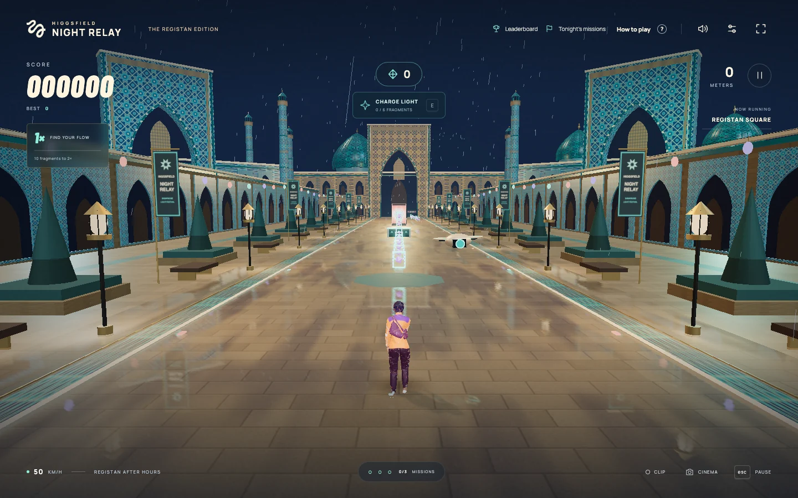
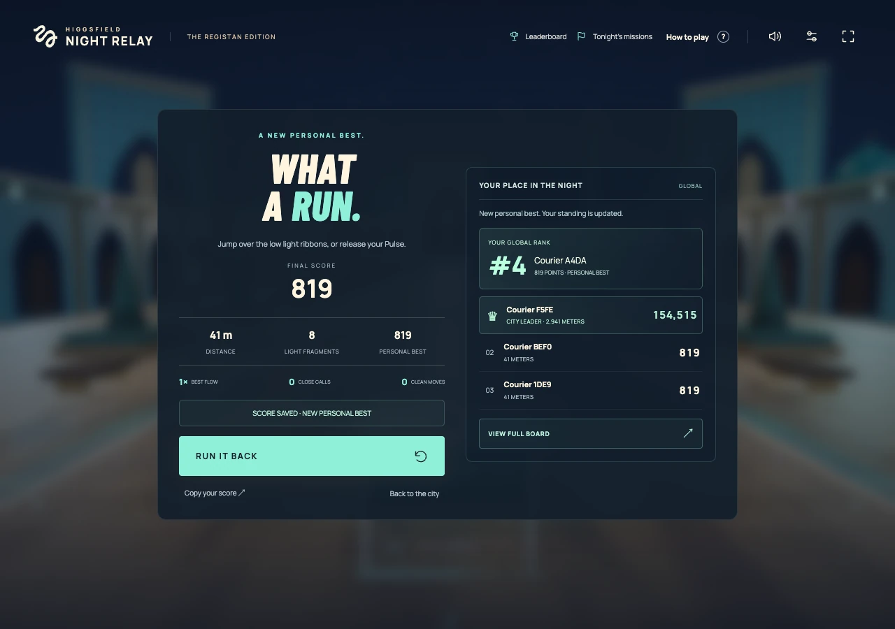
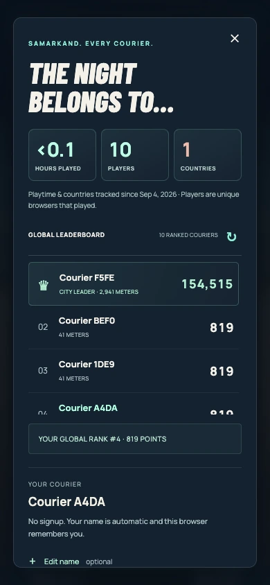
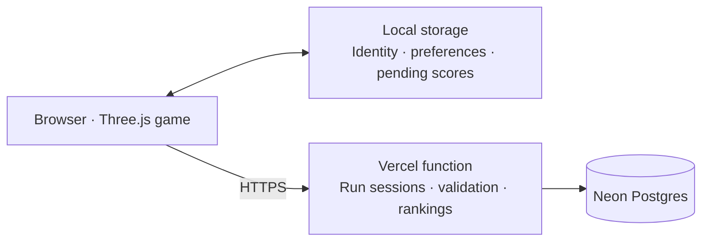

<div align="center">

# HIGGSFIELD NIGHT RELAY

**Samarkand · The Registan Edition**

Carry light through a city after dark.

[](https://github.com/Mukhsin0508/night-relay/actions/workflows/ci.yml)

[**Play in your browser →**](https://night-relay-samarkand.vercel.app/) · [Quick start](#quick-start) · [Controls](#controls) · [How it works](#how-it-works)

</div>


<p align="center"><sub>Concept artwork generated with GPT Image 2 through Higgsfield. Actual game captures appear below.</sub></p>

Night Relay is a playable 3D endless runner built with **TypeScript, Three.js, and Vite**. An original courier moves through an imagined light festival inspired by Samarkand’s Registan: tiled portals, turquoise domes, wet sandstone, and trails of glowing film frames.

Finish a commissioned mural, take the camera drone’s cue, and find your rhythm. Collect light, time your jumps and slides, then release a Pulse to dissolve the projections ahead. Every run can earn a place on the shared leaderboard—no signup required.

Created by [Mukhsin Mukhtorov](https://github.com/Mukhsin0508).

## Inside the game

- **A city built in code.** Procedural architecture, original geometric mosaics, festival installations, rain, reflections, and bloom.
- **A deliberate rhythm.** Three paths, jumps, slides, gradually faster routes, close calls, flow multipliers, and session missions.
- **Light Pulse.** Six fragments charge a manually triggered, 2.6-second passage through projections.
- **A living courier.** A Higgsfield-generated, animated character with natural footsteps, splashes, breathing, and an original WebAudio score.
- **Shared standings.** An automatic courier name, personal best, and exact global rank after each run. Optional renaming; no login.
- **Made for the browser.** Keyboard and touch controls, graphics and weather settings, cinema view, and downloadable silent gameplay clips.



_Actual game capture, running locally. The festival is fictional; the environment is not a historical reconstruction._

## Quick start

Use **Node.js 22.16+ or 24**. Node.js 24 is recommended; `.nvmrc` selects it.

```sh
git clone https://github.com/Mukhsin0508/night-relay.git
cd night-relay
npm ci
npm run dev
```

Open the local URL printed by Vite. **The full game is playable without a database or API keys.** Personal bests and preferences stay in the browser; global rankings need the optional backend below. Character models, fonts, and audio ship with the repository. Higgsfield credentials are not needed to run the game.

### Enable the shared leaderboard

Create your own Neon Postgres database, then:

```sh
cp .env.example .env.local
# Add your database connection strings to .env.local.
npm run db:migrate
npm run api:dev
```

`DATABASE_URL` is the runtime connection. Use the direct, non-pooled `DATABASE_URL_UNPOOLED` for migrations. The migration creates missing tables and indexes while preserving existing scores. `api:dev` serves Vite and the same leaderboard handler locally at `http://localhost:3000`, without a Vercel account. Set `PORT` to use another port. Keep `.env.local` private. Country detection is available on Vercel; local development leaves countries unknown.

To deploy, import the repository into Vercel, select the Vite preset, and configure `DATABASE_URL` for the environments you use. Run the migration against each target database before its first deployment. The build command is `npm run build`, the frontend output is `dist`, and the API lives at `/api/leaderboard`.

## Controls

| Action                                 | Keyboard       | Phone                     |
| :------------------------------------- | :------------- | :------------------------ |
| Change path                            | ← / → or A / D | Swipe left / right        |
| Jump                                   | ↑, W, or Space | Swipe up                  |
| Slide                                  | ↓ or S         | Swipe down                |
| Release charged Pulse                  | E              | Tap **Pulse**             |
| Pause / resume                         | Esc or P       | Tap pause                 |
| Start / restart                        | Enter          | Tap the main button       |
| Skip the opening                       | Enter or Space | Tap **Skip intro**        |
| Cinema view                            | C              | —                         |
| Record a silent clip, up to 15 seconds | R              | Use the recording control |

Optional movement buttons are available in Settings. Backgrounding the page pauses the run. **Cinematic / Performance** graphics and **Rain / Clear** weather let you tune the experience to your device.

## Every courier has a place

<table>
<tr>
<td width="72%"></td>
<td width="28%"></td>
</tr>
</table>

_Actual interface captures from an isolated development database with test couriers._

Each browser gets a random identity stored locally and a name such as **Courier A1B2**. There is no device fingerprint or account. You can edit the name, but nothing needs to be entered before playing. Clearing browser storage or changing browsers creates a new courier.

The board shows the top 25 plus your own rank, including when you are outside the top 25. The end-of-run view automatically displays the leading three and your standing. Only your best score counts per season; equal scores favor the earlier achievement.

Shared activity totals show **unique browsers that played, active playtime, and countries observed on gameplay requests**. Playtime excludes menus, cinematics, pauses, and hidden tabs. Country totals use Vercel request geolocation, not browser location permission. The board states when playtime and country tracking began; unknown historical activity is not estimated.

If a submission fails, a completed run with a server-issued session is retained in browser storage and retried after reconnection or reload. Offline runs without a server session stay local. Session ownership, request limits, and plausible score/timing checks help protect a casual leaderboard; the browser still controls gameplay, so this is not cheat-proof competitive infrastructure.

## How it works



| Area                | Main files                                                     | Responsibility                                                       |
| :------------------ | :------------------------------------------------------------- | :------------------------------------------------------------------- |
| Interface           | `src/main.ts`, `src/style.css`                                 | Input, menus, dialogs, settings, and result views                    |
| Gameplay            | `src/game/engine.ts`, `rules.ts`, `route.ts`, `progression.ts` | Frame loop, movement, collisions, fair routes, scoring, and missions |
| World               | `environment.ts`, `festival-models.ts`, `atmosphere.ts`        | Procedural architecture, festival props, weather, and lighting       |
| Character & opening | `human-runner.ts`, `relay-drone.ts`, `intro-camera.ts`         | Courier animation, camera drone, and continuous opening camera       |
| Sound & capture     | `audio.ts`, `recorder.ts`                                      | Sampled movement, synthesized sound, and clip export                 |
| Leaderboard         | `leaderboard-client.ts`, `leaderboard-ui.ts`                   | Anonymous identity, durable submissions, and rankings UI             |
| Backend             | `api/leaderboard.ts`, `server/`, `src/shared/leaderboard.ts`   | HTTP handler, database access, validation, and shared types          |

Unqualified game filenames in the table are under `src/game/`. The frontend has no runtime dependency on a generation service.

## Checks

```sh
npm test          # Gameplay rules, routes, scoring, Pulse, camera, client, and server tests
npm run format:check # Check consistent formatting
npm run typecheck # Check frontend, backend, scripts, and Vite configuration
npm run build     # Strict TypeScript checking and a production build
npm run preview   # Serve the built frontend locally
```

`preview` serves the frontend only. Database integration checks must use an **isolated, migrated test database**. Configure `LEADERBOARD_TEST_DATABASE_URL` and that database's direct `DATABASE_URL_UNPOOLED` in a private `.env.test.local`, then run:

```sh
node --env-file=.env.test.local --import tsx scripts/migrate.ts
npm run test:leaderboard
```

The integration suite creates temporary test players, checks score ownership, ordering, retries, concurrent activity reports, and totals, then removes its own records. It refuses to use the application's default database connection as its test database.

## Assets and attribution

Higgsfield was used to generate the original courier, movement audio, and the illustrated cover. Three.js renders the game; the architecture, mosaic patterns, festival props, and visual effects are created in code. The cover is concept art, while the gameplay and interface images above are direct browser captures.

Architectural reference: [UNESCO — Samarkand, Crossroad of Cultures](https://whc.unesco.org/en/list/603/). The setting depicts an imagined festival on freestanding art installations, not an event at the historic site. The Higgsfield glyph is a third-party brand asset and does not imply endorsement.

See [ASSETS.md](ASSETS.md) for asset provenance and usage boundaries, [in-game credits](public/credits.html) for attribution, and [illustration notes](docs/images/README.md) for the cover-generation workflow. Barlow Condensed and Manrope include their SIL Open Font License files in `public/fonts/`.

## Contributing

Small, focused improvements are welcome. See [CONTRIBUTING.md](CONTRIBUTING.md) for the local workflow and submission checklist. CI checks formatting, tests, and the production build on Node.js 22 and 24. Never include environment files, credentials, or production database exports.

## License

Project source code is available under the [MIT License](LICENSE). Generated media, fonts, and third-party names and marks have separate provenance and licensing considerations described in [ASSETS.md](ASSETS.md); the code license does not grant rights to those marks.
